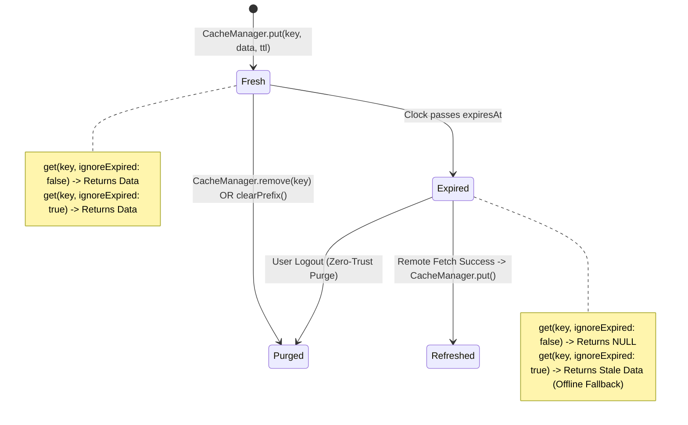
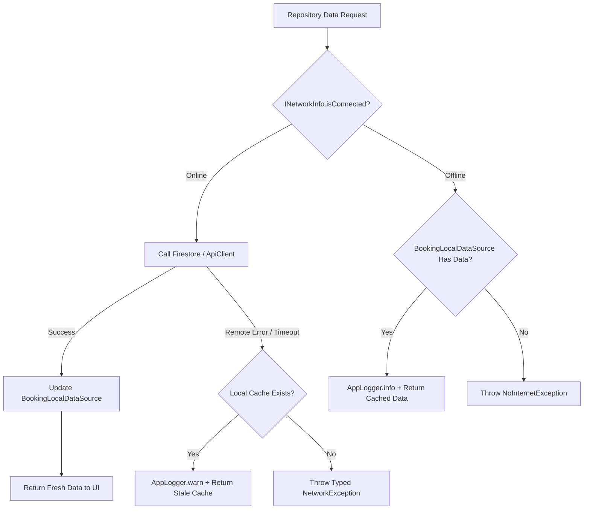

# Data Model: Local Caching & Offline Data Architecture

**Feature Branch**: `003-offline-cache`  
**Feature Spec**: [spec.md](spec.md)  
**Status**: Completed (Phase 1)  

---

## 1. Entities & Data Schemas

### 1.1 `CacheEnvelope`
The generic wrapper persisted in the local storage engine for every cached entity or collection.

```json
{
  "cachedAt": "2026-09-30T20:00:00.000Z",
  "expiresAt": "2026-10-02T20:00:00.000Z",
  "data": { ... }
}
```

#### Fields & Types
| Field | Type | Description | Nullable | Validation Rules |
|---|---|---|---|---|
| `cachedAt` | `String` (ISO 8601) | Timestamp when entry was stored locally | No | Valid UTC ISO-8601 string |
| `expiresAt` | `String` (ISO 8601) | Timestamp when entry transitions to expired | No | Must be strictly `>= cachedAt` |
| `data` | `dynamic` (Map / List / Primitive) | Serialized JSON payload | No | Must be encodable via `jsonEncode` |

---

### 1.2 `NetworkConnectivityState`
Domain representation of the current device network capability.

| Field | Type | Description |
|---|---|---|
| `isConnected` | `bool` | `true` if internet-capable route is available; `false` otherwise |
| `activeMediums` | `List<ConnectivityType>` | Active interfaces: `wifi`, `cellular`, `ethernet`, `vpn`, `none` |
| `lastChecked` | `DateTime` | Timestamp of latest evaluation |

---

### 1.3 `CachedBookingRecord`
The schema of a cached booking item stored in `CacheEnvelope.data`.

| Field | Type | Storage Format | Rules |
|---|---|---|---|
| `id` | `String` | String | Unique booking document ID |
| `userId` | `String` | String | Foreign key to user profile |
| `serviceId` | `String` | String | Foreign key to service catalog |
| `technicianId` | `String` | String | Assigned technician ID |
| `scheduledDate` | `String` | ISO 8601 | Target appointment time |
| `status` | `String` | String | `pending` \| `confirmed` \| `in_progress` \| `completed` \| `cancelled` |
| `address` | `String` | String | Physical appointment location |
| `totalPrice` | `num` | Double / Int | Must be `> 0` |
| `createdAt` | `String` | ISO 8601 | Original creation timestamp |
| `updatedAt` | `String` | ISO 8601 | Last modification timestamp |

---

## 2. Key Naming Standards & Storage Namespaces

| Scope | Key Pattern | Example |
|---|---|---|
| User Bookings Collection | `cached_bookings_user_{userId}` | `cached_bookings_user_usr_99812` |
| Individual Booking Details | `cached_booking_{bookingId}` | `cached_booking_bk_4412` |
| Service Catalog Master List | `cached_services_all` | `cached_services_all` |
| User Profile Snapshot | `cached_user_profile_{userId}` | `cached_user_profile_usr_99812` |

---

## 3. Cache Lifecycle & State Transitions



---

## 4. Connectivity & Fallback State Machine


